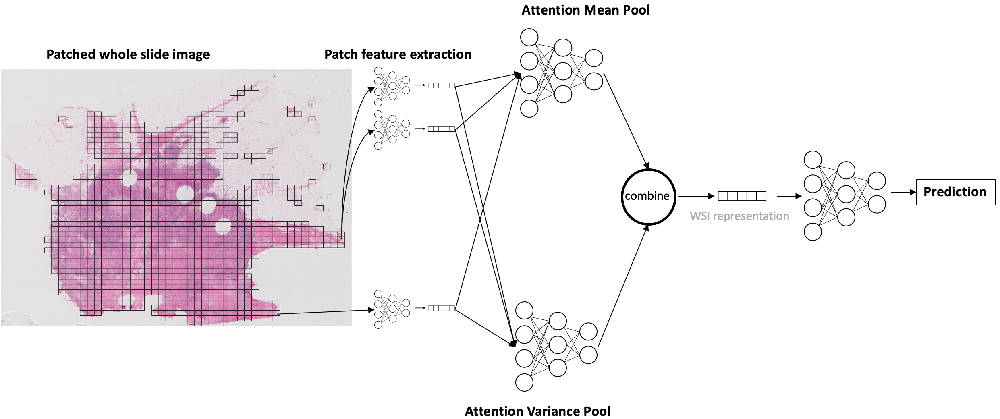

# Incorporating intratumoral heterogeneity into weakly-supervised deep learning models via variance pooling

**Carmichael, I.**\*, **Song, A.H.**\*, Chen, R.J., Williamson, D.F.K., Chen, T.Y., Mahmood, F. [Incorporating intratumoral heterogeneity into weakly-supervised deep learning models via variance pooling](https://arxiv.org/pdf/2206.08885.pdf). The International Conference on Medical Image Computing and Computer Assisted Intervention (MICCAI), 2022


**Abstract**: Supervised learning tasks such as cancer survival prediction
from gigapixel whole slide images (WSIs) are a critical challenge in computational pathology that requires modeling complex features of the tumor microenvironment. These learning tasks are often solved with deep
multi-instance learning (MIL) models that do not explicitly capture intratumoral heterogeneity. We develop a novel variance pooling architecture that enables a MIL model to incorporate intratumoral heterogeneity
into its predictions. Two interpretability tools based on “representative
patches” are illustrated to probe the biological signals captured by these
models. An empirical study with 4,479 gigapixel WSIs from the Cancer
Genome Atlas shows that adding variance pooling onto MIL frameworks
improves survival prediction performance for five cancer types.



# Updates
Please follow this GitHub for more updates.

# Setup


# 1. Downloading TCGA Data
To download diagnostic WSIs (formatted as .svs files) please refer to the [NIH Genomic Data Commons Data Portal](https://portal.gdc.cancer.gov/). WSIs for each cancer type can be downloaded using the [GDC Data Transfer Tool](https://docs.gdc.cancer.gov/Data_Transfer_Tool/Users_Guide/Data_Download_and_Upload/).

# 2. Processing Whole Slide Images
To process the WSI data we used the publicly available [CLAM WSI-analysis toolbox](https://github.com/mahmoodlab/CLAM). First, the tissue regions in each biopsy slide are segmented. The 256 x 256 patches without spatial overlapping are extracted from the segmented tissue regions at the desired magnification. Consequently, a pretrained truncated ResNet50 is used to encode raw image patches into 1024-dim feature vector. Using the CLAM toolbox, the features are saved as matrices of torch tensors of size N x 1024, where N is the number of patches from each WSI (varies from slide to slide). Please refer to [CLAM](https://github.com/mahmoodlab/CLAM) for examples on tissue segmentation and feature extraction. 
The extracted features then serve as input (in a .pt file) to the network. The following folder structure is assumed for the extracted features vectors:    
```bash
DATA_ROOT_DIR/
    └──TCGA_BLCA/
        ├── slide_1.pt
        ├── slide_2.pt
        └── ...
    └──TCGA_BRCA/
        ├── slide_1.pt
        ├── slide_2.pt
        └── ...
    ...
```
<DATA_ROOT_DIR> is the base directory of all datasets / cancer type(e.g. the directory to your SSD). Within <DATA_ROOT_DIR>, each folder contains a list of .pt files for that dataset / cancer type.

# 3. Run experiments

1. This step downloads the necessary clinical data csv file (slide names, clinical endpoints)

```bash
python tcga_scripts/download_tcga_clinical_data.py --save_dir <DATA_ROOT_DIR>/clinical_data --merge_coadread_gbmlgg
```

2. Next step is to run variance pooling experiment. Currently the available options are
- **task**: Refers to the options for the loss functions **rank_surv** (ranking loss) or **cox_surv** (cox proportional hazard loss)
- **arch_kind**: Refers to the options for the MIL architectures **amil** (Attention-based MIL), **deepsets** (average pooling MIL), or **patch_gcn** (Graph Convolutional Network MIL)
```bash
python run_all_fits.py --feats_top_dir <DATA_ROOT_DIR> --<OUTPUT_DIR> <OUTPUT_DIR> --task rank_surv --arch_kind amil --cuda 0
```


3. This command can help you visualize the most important patches along the variance projection directions.
```bash
python run_viz_top_patches.py
```

# License & Usage
If you find our work useful in your research, please consider citing our paper at:
```
@inproceedings{carmichael2022incorporating,
  title={Incorporating intratumoral heterogeneity into weakly-supervised deep learning models via variance pooling},
  author={Carmichael, Iain and Song, Andrew H and Chen, Richard J and Williamson, Drew FK and Chen, Tiffany Y and Mahmood, Faisal},
  booktitle={International Conference on Medical Image Computing and Computer-Assisted Intervention},
  pages={387--397},
  year={2022},
  organization={Springer}
}
```
